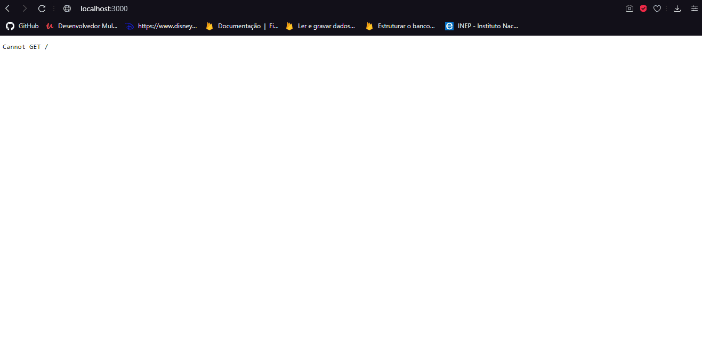
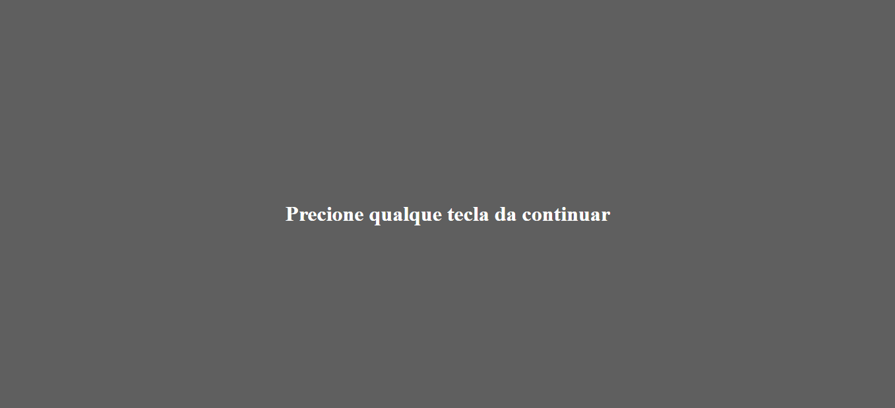
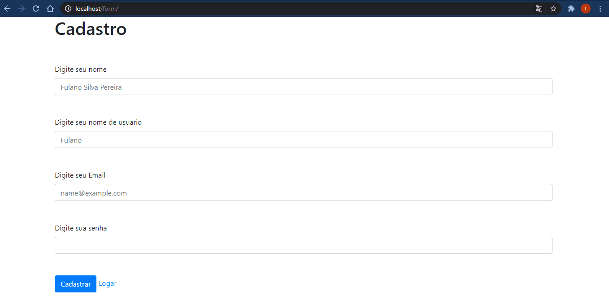
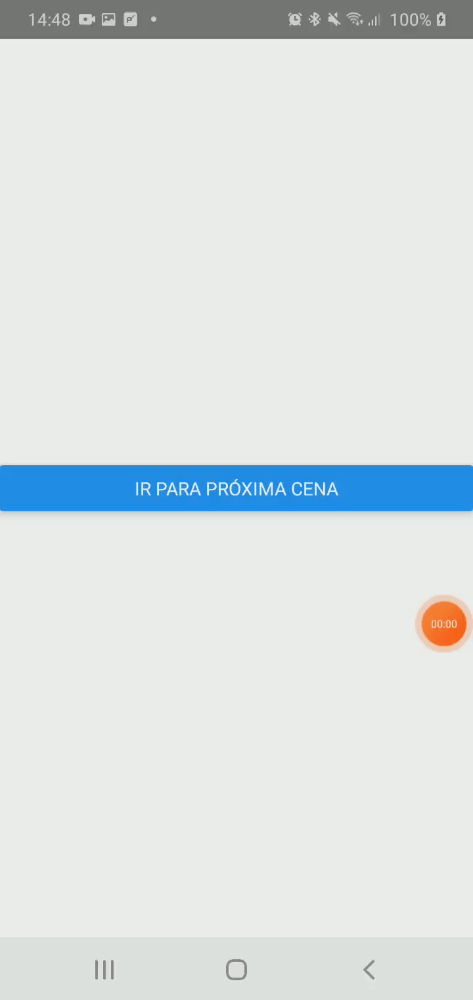

<h4 align="center" >
  A set of projects made in some languages and technologies
</h4>

  <a href="#igor-technologies">Technologies</a>

 
  

    <h2 align="center">Navegate between routes in NodeJs</h2>
    
  

 

 
  

    <h2 align="center">KeyCode</h2>
    
  

 

 
  

    <h2 align="center">PHP Form</h2>
    
  

 

  

    <h2 align="center">Navegate between screens on React Native</h2>
    
  

    <h2 align="center">Esse projeto foi densevolvido para uma entrevista de emprego usando as seguintes
tecnologias </h2>
    <ul>
      <li><a href="https://reactnative.dev">ReactNative</a></li>
      <li><a href="https://www.php.net/releases/8.0/en.php">PHP 8</a></li>
      <li><a href="https://getcomposer.org">Composer</a></li>
      <li><a href="https://nodejs.org/en/">NodeJS</a></li>
      <li><a href="https://expressjs.com/pt-br/">Express</a></li>
      <li><a href="https://www.apachefriends.org/pt_br/index.html">Xampp</a></li>
      <li><a href="https://www.apachefriends.org/pt_br/index.html">react-native-router-flux</a></li>
      <li><a href="https://getbootstrap.com">Bootstrap 4</a></li>
      <li><a href="https://code.visualstudio.com">VS Code</a></li>
    </ul>

